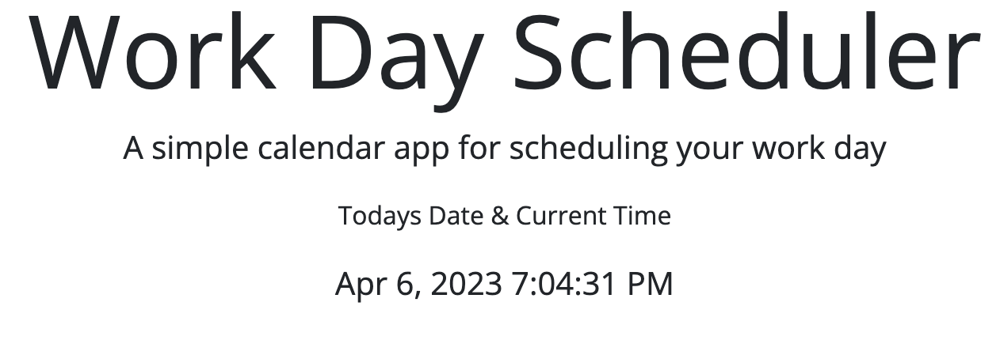
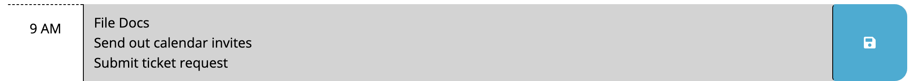

# Personal Daily Planner

## Description

[Link to deployed site] (https://jonnyboy808.github.io/personal-daily-planner/)

This simple and easy to use work day planner allows you enter your tasks for each hour of your working day. Depending on the hour you will see either a gray, red, or green box. A gray box represents any and all passed hours, red being the current time, and green being future time slots. As the day progresses the colored text boxes will change to their appropriate color to reflect the new present, past, and future boxes.

## Installation

No type of installation needed for this application, simply visit the above link and start entering your daily tasks.

## Technology used
Below are the links for styling and technology used:
Bootstrap: https://cdn.jsdelivr.net/npm/bootstrap@5.1.3/dist/css/bootstrap.min.css

FontAwesome: https://use.fontawesome.com/releases/v5.8.1/css/all.css

Google Fonts: https://fonts.googleapis.com/css?family=Open+Sans&display=swap

jQuery: https://code.jquery.com/jquery-3.4.1.min.js

Cloudflare: https://cdnjs.cloudflare.com/ajax/libs/moment.js/2.24.0/moment.min.js

DayJs: https://cdn.jsdelivr.net/npm/dayjs@1.11.3/dayjs.min.js

## Usage

This simple work day scheduler allows you to enter 3 lines worth of tasks for any given hour. Click the save symbol on the right side of the text box to make sure your task is saved if the webpage gets reloaded or if you visit the site at a later time. Any time that is not current and set in the past will be shown in a gray box, current time slots will be shown in red, and future time slots in green. With each passing hour you will see the time slots and colors update to match the corresponding time.

In the top section of this web page the current date and time is shown for your convinence. At the same time the seconds are shown to be constantly updated for your convinence. See below screenshot for an example.

Below is an example of the three lines of text you can input per time slot

---

Hope this plays an essential role to your productive day

## Credits

N/A

## License

No license at this time

---
